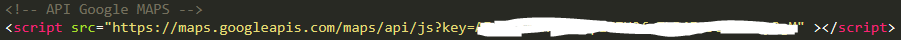
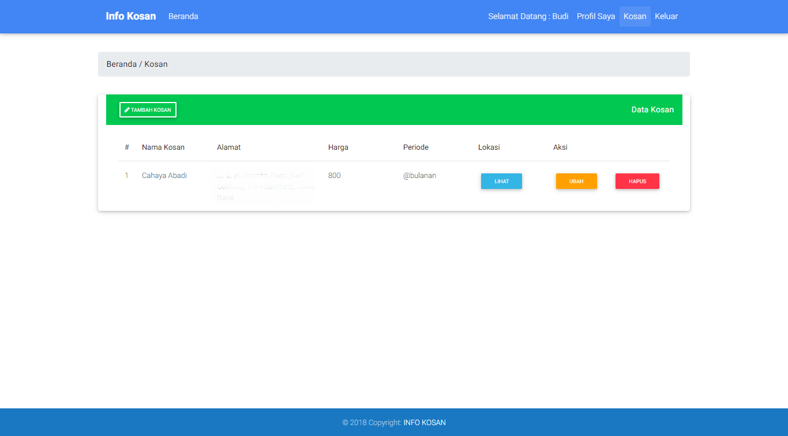
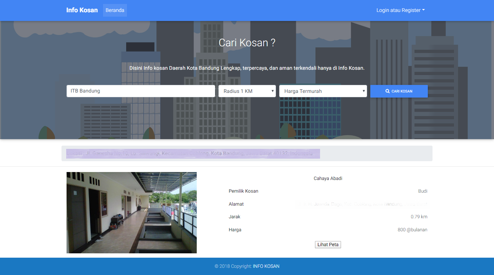

# kos-kosan
Aplikasi pencari tempat terdekat menggunakan Google Maps API 
Nearby place locator app using Google Maps API

<h4>Preparation</h4>
1. import database kos.sql  
2. Insert key Google Maps API in index.php and bodata.php

<h4>Screenshot owner splace</h4>

<h4>Screenshot guest</h4>

